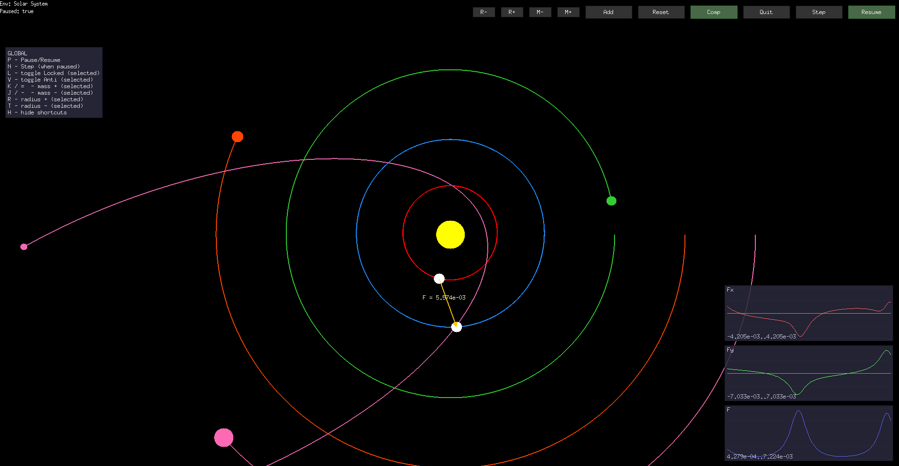

# gravity-sim

A simple N-body gravity simulator written in Go with Ebiten for visualization.

Features:
- N-body gravitational simulation with optional "anti-gravity" for selected bodies.
- Time integrator: semi-implicit (symplectic) Euler.
- Loadable scene configurations from JSON files in `pkg/assets/`.
- Interactive controls: pause, step, add bodies, change mass/radius, lock bodies, toggle anti-gravity.

Requirements:
- Go 1.25 or newer
- The Ebiten library (declared in `go.mod`)



Quick start:

```powershell
# with sample solar config
go run main.go -env solar
```

Available sample configs:
- `pkg/assets/solar.json` — sample solar-system-like scene
- `pkg/assets/3body.json` — three-body example
- `pkg/assets/space.json` — test scene

Configuration:
- `name` — environment name
- `dt` — simulation timestep (float)
- `bodies` — array of bodies, each with `mass`, `pos` [x,y], `vel` [x,y], `color` (hex)
- `auto_orbit` — if true, velocities for bodies after the first will be set to circular orbital speeds around the first body (the first body is treated as the central mass)

How it works:
- 2D vectors are defined in `pkg/physics/body.go` as `Vec2`.
- Bodies are represented by the `Body` struct (mass, position, velocity, acceleration, radius, color, `Locked` and `Anti` flags).
- Gravitational acceleration is computed in `pkg/physics/gravity.go` using a softening parameter to avoid singularities.
- The integrator is implemented in `pkg/physics/integrator.go` using a semi-implicit (symplectic) Euler scheme: velocities are updated first, then positions.

Controls (selected keys):
- P — pause / resume
- N — advance one step (when paused)
- H — toggle shortcuts visibility
- L — toggle Locked for the selected body or when adding a new body
- V — toggle Anti (anti-gravity)
- R / T — increase / decrease radius for the selected body
- = / - (or K / J) — increase / decrease mass

Project structure:
- `main.go` — UI, input handling, rendering, and simulation orchestration
- `pkg/physics/body.go` — vector and body definitions and basic operations
- `pkg/physics/gravity.go` — computing gravitational accelerations
- `pkg/physics/integrator.go` — semi-implicit Euler integrator
- `pkg/simulation/config.go` — reading JSON configuration and setting orbital velocities
- `pkg/simulation/simulator.go` — simulation loop and step management

Extending the project:
- Add new JSON scene files under `pkg/assets/` to define initial setups.
- Implement additional integrators (e.g., RK4) in `pkg/physics` and wire them into `pkg/simulation`.
- Make parameters like the gravitational constant or softening configurable at runtime.

Troubleshooting:
- If bodies "explode" or diverge, lower the `dt` in the JSON config or increase the softening parameter (`epsilon`) in `pkg/physics/gravity.go`.
